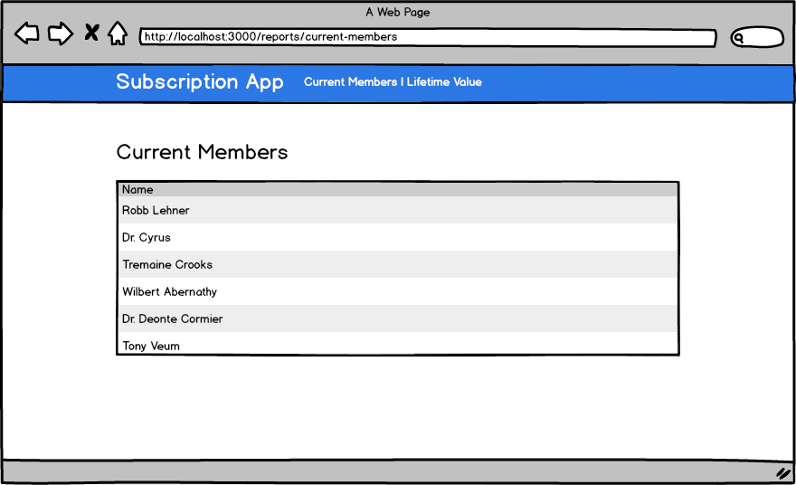
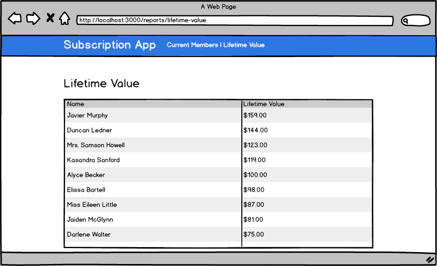

# Lifetime Value

## Setup

* `bundle`
* `rake db:create db:migrate db:seed`
* `rails s`

You can run specs with:

* `rspec`

Note: email/password combinations for existing users populated by `rake db:seed` can be found in the db/seeds.rb file.

## Current Subscribers

This app tracks subscriptions.  

When a user subscribes, it adds a row to the `subscription_events` table that looks like this:

user_id | date       | event_type | price_per_month_in_cents
------- | ---------- | ---------- | ------------------------
      2 | 2014-06-01 | subscribed |                      700

When user unsubscribes, it adds a row to the `subscription_events` table that looks like this:

user_id | date       | event_type   | price_per_month_in_cents
------- | ---------- | ------------ | ------------------------
      2 | 2014-06-01 | unsubscribed |                         

From this, we can say that a user is subscribed if their most recent subscription event is
"subscribed".  For example, users `2` and `3` below would both be subscribed:

user_id | date       | event_type    |  price_per_month_in_cents
------- | ---------- | ------------- |  ------------------------
      2 | 2014-05-01 | subscribed    |                       700
      3 | 2014-03-01 | subscribed    |                      1200
      3 | 2014-04-01 | unsubscribed  |                          
      3 | 2014-05-01 | subscribed    |                       500

Whereas in the example below, user `5` would _not_ be subscribed:

user_id | date       | event_type    |  price_per_month_in_cents
------- | ---------- | ------------- |  ------------------------
      5 | 2014-04-01 | subscribed    |                       700
      5 | 2014-05-01 | unsubscribed  |                          


## Lifetime Value

Users can subscribe with different amounts / month.  When a user subscribes,
it says the amount that they will pay per month.  In addition to unsubscribing,
the `subscription_events` table can also show that a user's subscription price has
changed.  For example, this user paid $7.00 for January, and $4.00 for February.

user_id | date       | event_type    |  price_per_month_in_cents
------- | ---------- | ------------- |  ------------------------
      5 | 2014-01-01 | subscribed    |                       700
      5 | 2014-02-01 | changed       |                       400

If today's date is `2014-03-01`, then the lifetime value of the user above would be $11.00.

If today's date is `2014-04-01`, then the lifetime value of the user would be $15.00

`($7 * 1 month) + ($4 * 2 months) == $15`

## Stories

**Site administrators can see who the current members are**

```
When I login
I should be able to click a "Current Members" link
And see a table that lists all users who are current subscribers
And the list should be sorted by name
```

**Users can see the lifetime value of each user**

```
When I login
I should be able to click a "Lifetime Value" link
And see a table that lists all users
And next to each user I should be able to see their lifetime value
And the rows should be sorted by the lifetime value (highest first)
```

## Checking your work

To check your work:

* Run `rake db:seed` again to make sure your data was generated the same day you are checking
* Go to your web page
* Compare the results to [these answers](ANSWERS.md)

## Think about it

* How well would your code fare if you had to pull data from an JSON API, instead of from the database?
* Do you have to create `SubscriptionEvent` objects in your specs?  If so, can you figure out a way to just instantiate
them (instead of saving them to the database)?
* Do you have to require `rails_helper` for your specs, or can you just require `spec_helper`?

## Wireframes

**Current Members**



**Lifetime Value**


